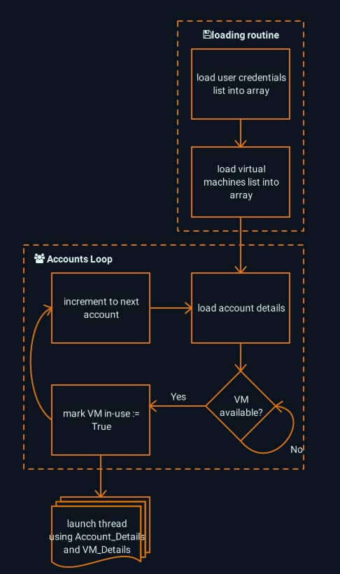

## Goals:
- Ability to run and control multiple Android virtual machines concurrently via ADB over network.
  - Flowchart of idea for main program:

  - pseudo code outlining the idea in broad strokes:
```
; load list of account credentials into accounts_array
; load list of Android VM (Virtual Machine) ip and ports into VM_Array

for account in accounts_array ; loop through account
{
  credentials := {name:account[0], username:account[1], password:account[2], PIN:account[3]}
  Use_Available_VM(credentials)
}

Use_Available_VM(credentials)
{
  for VM in VM_Array : loop through VM_Array and find one that's not being used
    if (VM[0] = False) or if (VM.In_Use = False)
    {
      VM_Details := {In_Use:VM[0], name:VM[1], ip:VM[2], port:VM[3]}
      break loop
    }
  ; launch separate program thread using VM_Details and credentials
  run Threaded_Routine_Execution.ahk VM_Details credentials
  VM.In_Use = True ; Mark selected VM as in-use
  return VM_Details ; IP and port number of used virtual machine
}

Threaded_Routine_Execution.ahk
{
  log into retrieved account using available VM_Details
  Execute routines
  ; when finished notify main process that VM is available for another account
  VM_Details.In_Use = False
}
```
- Actual adb Commands:
  - Connect to Android virtual machine via ADB over Network:
On the computer, start adb in tcpip mode:
Command: `adb tcpip <port>`
Example: `adb tcpip 5555`
  - Connect to your android device over network:
Command: `adb connect <ip address of android phone>:<port>`
Example: `adb connect 10.0.0.212:5555`

- Remotely control virtual machines running Android and push ADB shell commands via IP:
  - example by [james2doyle](https://gist.github.com/james2doyle): Use adb to swipe and take screenshots. Then use tesseract to OCR the images [abd-screen-ocr.sh](https://gist.github.com/james2doyle/69aed02241ab6cc4d2bdb4d818c19f27)
```
#!/usr/bin/env bash

# make sure to start your screen at the top
# 21 was the number of swipes to get to the bottom of my page
for i in `seq 1 21`;
do
  adb exec-out screencap -p > "screen$i.png"
  sleep 1
  # scroll "1300" each time
  adb shell input swipe 0 1300 300 300
  sleep 1
done

# then, OCR those images
for FILE in *.png
do
  tesseract $FILE stdout >> output.txt
done
```
   - example by [haideralipunjabi](https://github.com/haideralipunjabi) of running ADB over Network using python and solving Sudoku puzzles: [sudoku_automate](https://github.com/haideralipunjabi/sudoku_automate)
```
if __name__ == "__main__":
    # Connect the device using ADB
    device = adb.connect_device()
    # Take Screenshot of the screen and save it in screen.png
    adb.take_screenshot(device)
    image = Image.open('screen.png')
    image = process_image(image)        # Process the image for OCR
    org_grid = get_grid_from_image(image)      # Convert the Image to 2D list using OCR / Pytesseract
    solved_grid = deepcopy(org_grid)        # Deepcopy is used to prevent the function from modifying the original sudoku game
    solve_sudoku(solved_grid)
    automate_game(org_grid, solved_grid)        # Input the solved game into your device
```

## CheckList:
 [ ] parse out tap coordinates and turn them into variable arrays.
```
; existing code
Mouse_Click(290,405) ; Tap on base
Mouse_Click(359,487) ; Tap On City Buffs
Mouse_Click(302,235) ; Tap on Peace shield

; resulting in changes
Set_Tap_Coordinats:
{
   Tap_base := ["290","405"]
   Tap_CityBuffs := ["359","487"]
   Tap_Peace_Shield := ["302","235"]
}

Open_Peace_Shield:
{
   Mouse_Click(Tap_base)
   Mouse_Click(Tap_CityBuffs)
   Mouse_Click(Tap_Peace_Shield)
}
```
 [ ] Detect RenderWindow control dimensions inside MEMUplay.
   - Partially imlemented using 'Win_WaitRegEX()' function contained in [CowNinja_Functions.ahk](lib/CowNinja_Functions.ahk):
```
	global FoundAppClass := "Qt5QWindowIcon"
	global FoundAppControl := "Qt5QWindowIcon19" ; static set of which control is RenderWindow
	LEWZApp := Win_WaitRegEX(NewTitle)
	global FoundAppTitle := LEWZApp.title
	global FoundAppClass := LEWZApp.Class
	global FoundAppProcess := byref FoundAppControl
	global FoundAppID := LEWZApp.ID

	NewTitle := RegExReplace(FoundAppTitle,"[^A-Za-z0-9]+")
	WinSetTitle, %NewTitle%
```
   - Would like to implement using 'Control_GetInfo()' function as 'Control' and 'ClassNN' can change based on configuration of MEMUplay:
```
; AppX := Control_GetInfo("Qt5QWindowIcon", FoundAppTitle)
MsgBox, 0, AppX, % " AppX " AppX.Text " " AppX.Hwnd " " AppX.X " " AppX.Y
; or
MsgBox, 0, AppX, % " AppX.X " AppX().X " AppX.Y " AppX().Y
```

5. Bilinear Interpolation For Data On A Rectangular Grid for stored coordinates to correspond to detected resolution changes, for example:
```
; Tap coordinates based on a fixed resolution
StoredApp_Width
StoredApp_Height
StoredTap_X
StoredTap_Y

; Get App_Window Height and Width
CurrentApp_Width
CurrentApp_Height
CurrentTap_X
CurrentTap_Y

; Calculate coordinate interpolation based on the new cursor position '(CurrentTap_X,CurrentTap_Y)', the stored position '(StoredTap_X,StoredTap_Y)',
; old window size '(StoredApp_Width,StoredApp_Height)', and the new window size '(CurrentApp_Width,CurrentApp_Height)'.
CurrentTap_X := ((StoredTap_X / StoredApp_Width) * CurrentApp_Width)
CurrentTap_Y := ((StoredTap_Y / StoredApp_Height) * CurrentApp_Height)
```

## Current Settings:
1. I've constrained the Android Client MEMUplay to run at a set resolution for now:
   - the size of the app window is defined in [LEWZ_SetDefaults.ahk](lib/LEWZ_SetDefaults.ahk):
```
; Define desired window position and size
Global App_Win_X := 0
Global App_Win_Y := 0
Global App_WinWidth := 730
Global App_WinHeight := 1249

; actual Game Area within MEMUplay:
; ClassNN: Qt5QWindowIcon19
; Text: RenderWindowWindow
; Client: x: 1 y: 32 w: 689 h: 1216
```
   - formatting the size and location of the window is implemented in [CowNinja_Functions.ahk](lib/CowNinja_Functions.ahk):
```
Check_Window_Geometry:
WinMove, %FoundAppTitle%, , App_Win_X, App_Win_Y, App_WinWidth, App_WinHeight ; Move the window preset coords
```
2. Account Credentials (Title,email,password,PIN are stored in seperated by commas) are retrieved from [LEWZ_User_Logins.ini](LEWZ_User_Logins.ini.example) in AHK directory and all account credentials are loaded into an array during execution of [LEWZ_SetDefaults.ahk](lib/LEWZ_SetDefaults.ahk).  :
```
; load User Logins
User_Logins := {}
Loop, Read, LEWZ_User_Logins.ini
{
    row := StrSplit(A_LoopReadLine, ",")
    user := row[1]
    row.RemoveAt(1)
    User_Logins[user] := row
}
```
   - [LEWZbot_Script.ahk](LEWZbot_Script.ahk) loads each set of account credentials and assigns corresponding values to global variables before moving to subroutines execution as follows:
```
; Switch User
For User,Val in User_Logins
{
	; Populate account variables from next keyed array item
	global User_Name := User
	global User_Email := Val[1]
	global User_Pass := Val[2]
	global User_PIN := Val[3]
```

## Notes:
1. Since I run the Android inside an emulator, I have to use tesseract OCR screen recognition which reads the screen, extrapolates the text, and figures out if a particular menu item has loaded or not, and then it taps. I use the home screen as a point of reference because you can hit back a million times and as soon as quit dialogue is displayed, it terminates the go back to home screen routine.
2. x and y coordinates are determined using OCR screen reader, when a found a text matches stored text strings in an array, then tap coordinates are calculated.
3. 19FEB21 - Finally took the time to reprogram and fix my shielding routine, which calculates and auto shields Thursday 1900 through Sunday 1900.. the delays are due to reading the screen, converting via OCR to text, and responding accordingly. I haven't implemented multi-threading yet, which will enable concurrently running multiple instances simultaneously.
4. 13FEB21 - my routines rely on specific sequences of events that I've figured out, calculated, and timed.. there are countermeasures in-game code to detect messing with the proprietary game data.. so it's very touchy

## Issues:
1. sometimes clicking on underground will result in the "welcome to level 20 underground area" dialog.. so I just have to develop the script to recognize the text on the screen and tap accordingly..

## More info:

## Tools Used:
1. [AutoHotkey](https://www.autohotkey.com/) in windows to interact with MEMUplay Android client. AutoHotKey is a free, open-source scripting language for Windows that allows users to easily create small to complex scripts for all kinds of tasks such as form fillers, auto-clicking, macros, etc.
2. [MEMUplay android client](https://www.memuplay.com/download.html) runs android in a virtual machine where games are loaded and played using AutoHotKey script.
3. adb (Android debug bridge) will be utilized to remotely control Android virtual machines and is included in [Android SDK Platform Tools](https://developer.android.com/studio/releases/platform-tools).
4. Simple OCR using Tesseract [iseahound](https://github.com/iseahound)/[Vis2](https://github.com/iseahound/Vis2)
5. [Notepad++](https://notepad-plus-plus.org/downloads/) is a free (as in “free speech” and also as in “free beer”) source code editor and Notepad replacement that supports several languages. Running in the MS Windows environment.
   - [Notepad++ for AutoHotkey](https://github.com/jNizM/ahk_notepad-plus-plus) formats AHK files in Notepad++.

### AutoHotKey
1. Great AutoHotkey technical source with example code [renenyffenegger AutoHotKey notes](https://renenyffenegger.ch/notes/tools/autohotkey/index)
2. Learn more about AutoHotkey: [The Magic of AutoHotkey, The Sharat's](https://sharats.me/posts/the-magic-of-autohotkey/)
3. [AutoHotkey Expression Examples: "" %% () and all that](https://daviddeley.com/autohotkey/xprxmp/autohotkey_expression_examples.htm), because I can never get them right, so I made this. These are all working examples.

### Code Examples:
1. [Connecting to Android Device with ADB over WiFi made (a little) easy](https://medium.com/@amanshuraikwar.in/connecting-to-android-device-with-adb-over-wifi-made-a-little-easy-39439d69b86b)
2. Article and step by step instructions for Python implementation of automatic Sudoku solving program: [Automating Android Games with Python & Pytesseract: Sudoku](https://blog.haideralipunjabi.com/posts/automating-android-game-with-python-pytesseract-sudoku/), by Haider Ali Punjabi, Level Up Coding.
